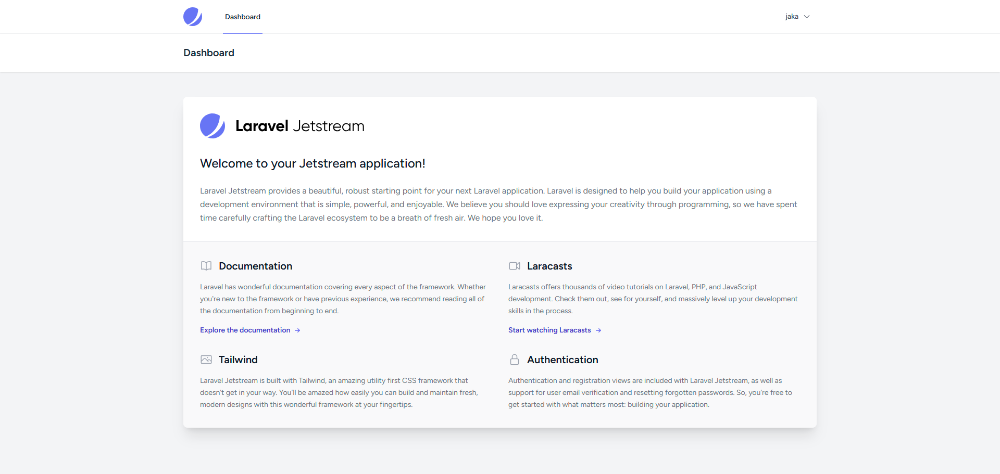

# Laravel Jetstream Installation Guide for Windows 🚀

[](https://laravel.com)
[](https://jetstream.laravel.com)
[](https://www.php.net)
[](https://www.postgresql.org)

Panduan lengkap instalasi Laravel dengan Jetstream di Windows menggunakan PostgreSQL sebagai database. Cocok untuk developer yang ingin setup environment development yang professional dan modern.

## 📋 Table of Contents

- [Prerequisites](#prerequisites)
- [Laravel Installation](#laravel-installation)
- [Jetstream Installation](#jetstream-installation)
- [Running the Application](#running-the-application)
- [Troubleshooting](#troubleshooting)
- [Useful Commands](#useful-commands)
- [Project Structure](#project-structure)

## 🔧 Prerequisites

### 1. Install PHP 8.1+

1. Download PHP dari [windows.php.net](https://windows.php.net/download/)
2. Pilih versi PHP 8.1 atau yang lebih baru (Thread Safe)
3. Extract ke folder `C:\php`
4. Tambahkan `C:\php` ke PATH environment variable:
   - Buka Control Panel → System → Advanced System Settings
   - Klik "Environment Variables"
   - Di System Variables, cari "Path" dan klik Edit
   - Tambahkan `C:\php`
5. Copy `php.ini-development` menjadi `php.ini`
6. Edit `php.ini` dan uncomment (hapus `;`) extension berikut:

```ini
extension=curl
extension=fileinfo
extension=gd
extension=mbstring
extension=openssl
extension=pdo_mysql
extension=pdo_pgsql
extension=pdo_sqlite
extension=sqlite3
extension=zip
```

### 2. Install Composer

1. Download Composer dari [getcomposer.org](https://getcomposer.org/download/)
2. Jalankan installer `Composer-Setup.exe`
3. Ikuti wizard instalasi (pastikan PHP path sudah benar)
4. Restart command prompt
5. Verifikasi instalasi:

```bash
composer --version
```

### 3. Install Node.js dan NPM

1. Download Node.js dari [nodejs.org](https://nodejs.org/)
2. Install versi LTS terbaru
3. Restart command prompt
4. Verifikasi instalasi:

```bash
node --version
npm --version
```

### 4. Install PostgreSQL

1. Download PostgreSQL dari [postgresql.org](https://www.postgresql.org/download/windows/)
2. Install PostgreSQL (versi 12 atau yang lebih baru)
3. Selama instalasi:
   - Catat password untuk user `postgres`
   - Port default: 5432
   - Install pgAdmin 4 (GUI tool untuk manage database)
4. Setelah instalasi, buka pgAdmin 4 untuk memverifikasi koneksi

## 🚀 Laravel Installation

### 1. Install Laravel Installer (Global)

```bash
composer global require laravel/installer
```

Tambahkan Composer global bin ke PATH:
- Tambahkan `%USERPROFILE%\AppData\Roaming\Composer\vendor\bin` ke PATH environment variable

### 2. Buat Proyek Laravel Baru

Buka Command Prompt atau PowerShell, navigasi ke folder tempat Anda ingin membuat proyek:

```bash
# Method 1: Menggunakan Laravel Installer
laravel new nama-proyek

# Method 2: Menggunakan Composer (alternatif)
composer create-project laravel/laravel nama-proyek
```

### 3. Masuk ke Direktori Proyek

```bash
cd nama-proyek
```

### 4. Setup Environment

1. Copy file `.env.example` menjadi `.env`
2. Generate application key:

```bash
php artisan key:generate
```

### 5. Konfigurasi Database PostgreSQL

Edit file `.env` dan sesuaikan konfigurasi database:

```env
DB_CONNECTION=pgsql
DB_HOST=127.0.0.1
DB_PORT=5432
DB_DATABASE=nama_database
DB_USERNAME=postgres
DB_PASSWORD=password_postgresql_anda
```

### 6. Buat Database PostgreSQL

#### Method 1: Menggunakan pgAdmin 4 (GUI)
1. Buka pgAdmin 4
2. Login dengan password postgres
3. Klik kanan pada "Databases" → Create → Database
4. Masukkan nama database sesuai dengan `.env` file

#### Method 2: Menggunakan Command Line (psql)
```bash
# Login ke PostgreSQL
psql -U postgres -h localhost

# Buat database baru
CREATE DATABASE nama_database;

# List database untuk verifikasi
\l

# Keluar
\q
```

### 7. Test Laravel

```bash
php artisan serve
```

Buka browser dan akses [http://localhost:8000](http://localhost:8000)

## ⚡ Jetstream Installation

### 1. Install Jetstream via Composer

```bash
composer require laravel/jetstream
```

### 2. Install Jetstream dengan Stack Pilihan

#### Option A: Livewire Stack (Direkomendasikan untuk pemula)
```bash
php artisan jetstream:install livewire
```

#### Option B: Inertia.js Stack (Untuk yang familiar dengan Vue.js)
```bash
php artisan jetstream:install inertia
```

### 3. Install dan Compile Assets

```bash
npm install
npm run build
```

Untuk development, gunakan:
```bash
npm run dev
```

### 4. Jalankan Database Migration

```bash
php artisan migrate
```

### 5. Install Teams Feature (Optional)

Jika ingin menggunakan fitur teams:

```bash
php artisan jetstream:install livewire --teams
```

Kemudian jalankan lagi:
```bash
npm install && npm run build
php artisan migrate
```

## 🏃‍♂️ Running the Application

### 1. Start Development Server

```bash
php artisan serve
```

### 2. Compile Assets (di terminal terpisah)

```bash
# Untuk development (watch mode)
npm run dev

# Atau untuk production
npm run build
```

### 3. Akses Aplikasi

Buka browser dan akses [http://localhost:8000](http://localhost:8000)

Anda akan melihat halaman Laravel dengan fitur authentication yang sudah siap:
- ✅ Register
- ✅ Login
- ✅ Dashboard
- ✅ Profile Management
- ✅ Two-Factor Authentication (jika diaktifkan)

## 📸 Screenshots

### Login Page


### Register Page


### Dashboard


*Catatan: Screenshot diambil setelah menjalankan `php artisan serve` dan `npm run dev`*

## 🔧 Troubleshooting

### Error 1: "Class 'PDO' not found"
**Solusi:** Pastikan extension `pdo` dan `pdo_pgsql` sudah diaktifkan di `php.ini`

### Error 2: "fileinfo extension must be installed"
**Solusi:** Aktifkan `extension=fileinfo` di `php.ini`

### Error 3: "The Process class relies on proc_open"
**Solusi:** Aktifkan `proc_open` function di `php.ini` (hapus dari `disable_functions`)

### Error 4: NPM/Node.js command not found
**Solusi:** Restart command prompt setelah install Node.js dan pastikan PATH sudah benar

### Error 5: Database connection error
**Solusi:** Pastikan:
- PostgreSQL service running (cek di Services Windows)
- Database sudah dibuat
- Kredensial di `.env` sudah benar
- Extension `pdo_pgsql` aktif di PHP

## 📁 Project Structure

```
laravel-project/
├── app/                    # Aplikasi core files
│   ├── Models/            # Eloquent models
│   ├── Http/Controllers/  # Controllers
│   └── ...
├── config/                # Konfigurasi aplikasi
├── database/
│   ├── migrations/        # Database migrations
│   └── seeders/          # Database seeders
├── resources/
│   ├── views/            # Blade templates
│   ├── js/               # JavaScript assets
│   └── css/              # CSS assets
├── routes/
│   ├── web.php           # Web routes
│   └── api.php           # API routes
└── .env                  # Environment configuration
```

## ⚡ Useful Commands

```bash
# Lihat semua command artisan
php artisan

# Buat controller
php artisan make:controller NamaController

# Buat model
php artisan make:model NamaModel

# Buat migration
php artisan make:migration create_table_name

# Clear cache
php artisan cache:clear
php artisan config:clear
php artisan view:clear
```

## 🎉 Selesai!

Selamat! Laravel dengan Jetstream sudah terinstall dan siap digunakan. Anda sekarang memiliki aplikasi web modern dengan fitur authentication lengkap yang siap untuk dikembangkan lebih lanjut.

## 🤝 Contributing

Jika Anda menemukan kesalahan atau ingin menambahkan informasi, silakan buat issue atau pull request.

## 📄 License

Guide ini dibuat untuk membantu komunitas developer Indonesia. Feel free to use and share!

---

**Happy Coding!** 🚀